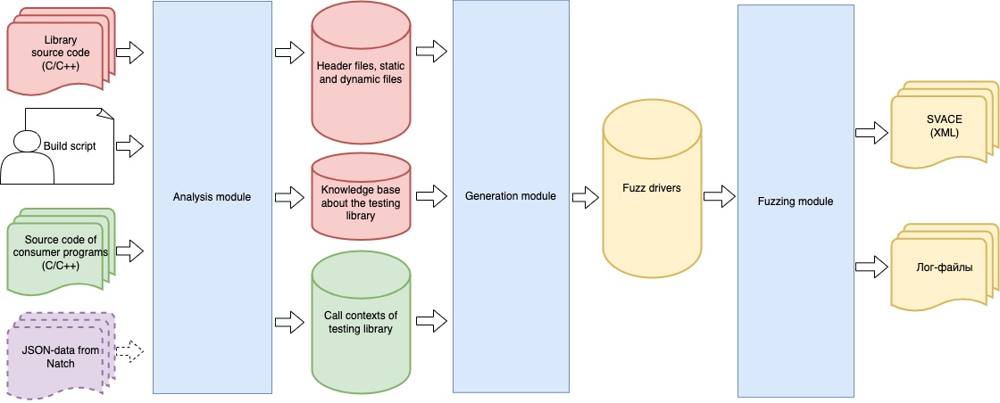

# Оглавление

- [Оглавление](#оглавление)
  - [1. Описание](#1-описание)
  - [2. Установка](#2-установка)
  - [3. Примеры использования](#3-примеры-использования)
  - [4. Авторы](#4-авторы)
  - [5. Статьи и материалы](#5-статьи-и-материалы)
  - [6. Найденные ошибки](#6-найденные-ошибки)

# 1. Описание

FUTAG — это инструмент автоматизированной генерации фаззинг-оберток для программных библиотек.
FUTAG предоставляет возможность генерации фаззинг-оберток как в случае отсутствия контекстов использования тестируемой библиотеки, так и при их наличии. 
FUTAG  использует, в  качестве внешнего интерфейса, для анализа исходного кода библиотек инструментарий Clang.  

Статический анализатор, реализованный в FUTAG, во время сборки тестируемой библиотеки выполняет:
- поиск определений сущностей (типы данных, функции, структуры и т.д.);
- поиск зависимостей между сущностями.
Собранная информация сохраняется как база знаний о тестируемой библиотеке (БЗТ). В условиях отсутствия котекстов использования  библиотеки, FUTAG-генератор изучает БЗТ и создает фаззинг-обертки. 

При наличии контекстов использования, FUTAG выполняет поиск вызовов функций, составляет зависимости между найденными вызовами и оформляет контексты вызовов.

В Futag так же реализована возможность получения контекстов использования тестируемой библиотеки от инструмента для определения поверхности атаки [Natch](https://github.com/ispras/natch).

Работа Futag иллюстрируется на следующем рисунке: 


Данный проект основан на LLVM со статическим анализом Clang и распространяется под лицензией ["GPL v3 license"](https://llvm.org/docs/DeveloperPolicy.html#new-llvm-project-license-framework)

# 2. Установка
## 2.1. Использование докер-контейнера
Вы можете попробовать собрать Futag с готовыми [Докер-файлами](https://github.com/ispras/Futag/tree/main/product-tests/build-test) для ОС Ubuntu.

## 2.2. Использование предварительно упакованного пакета
- Загрузите последнюю версию [futag-llvm.2.0.4.tar.xz](https://github.com/ispras/Futag/releases/tag/2.0.4) и разархивируйте. В результате инструмент будет установлен в директорию futag-llvm.
- Для сборки AFLplusplus запустите скрипт buildAFLplusplus.sh в futag-llvm

```bash
  ~/futag-llvm$ ./buildAFLplusplus.sh
```

## 2.3. Сборка и установка из исходного кода

### 2.3.1. Зависимости
Данная инструкция позволяет собрать копию проекта и запустить её в Unix-подобной системе. 

Инструмент FUTAG основан на [LLVM-project](https://llvm.org/). Для компиляции проекта необходимо, чтобы следующие пакеты были установлены в вашей системе:

- [CMake](https://cmake.org/) >=3.13.4 [cmake-3.19.3-Linux-x86_64.sh](https://github.com/Kitware/CMake/releases/download/v3.19.3/cmake-3.19.3-Linux-x86_64.sh) - Makefile/workspace generator
- [GCC](https://gcc.gnu.org/)>=7.1.0 C/C++ compiler
- [Python](https://www.python.org/) >=3.8 Automated test suite.
- [pip](https://pypi.org/project/pip/) >=22.0.4
- [zlib](http://zlib.net/) >=1.2.3.4 Compression library
- [GNU Make](http://savannah.gnu.org/projects/make) 3.79, 3.79.1 Makefile/build processor
- [Binutils](https://www.gnu.org/software/binutils/)

Для получения более детальной информации о зависимостях, необходимых для сборки LLVM, вы можете ознакомиться с документацией по указанной [ссылке](https://llvm.org/docs/GettingStarted.html#requirements)

В системе Ubuntu возможно требуется установить пакеты:
- python-is-python3.
- gcc-multilib
- binutils-gold binutils-dev

### 2.3.2. Сборка и установка

- Клонируйте проект:

```bash
  ~$ git clone https://github.com/ispras/Futag
```
- Подготовьте директорию "custom-llvm", запустив скрипт:
```bash
  ~/Futag/custom-llvm$ ./prepare.sh
```
Этот скрипт создает директорию Futag/build и копирует  в неё скрипт Futag/custom-llvm/build.sh

- Запустите скопированный скрипт в "Futag/build":

```bash
  ~/Futag/build$ ./build.sh
```

- В результате инструмент будет установлен в директорию Futag/futag-llvm

- Для сборки AFLplusplus запустите скрипт buildAFLplusplus.sh в Futag/futag-llvm

```bash
  ~/Futag/futag-llvm$ ./buildAFLplusplus.sh
```

## 3. Примеры использования
- Предварительно должен быть установлен пакет futag-<версия>.tar.gz по пути futag-llvm/python-package/:
```bash
  ~$ pip install -r futag-llvm/python-package/requirements.txt
  ~$ pip install futag-llvm/python-package/futag-2.0.4.tar.gz
```
- Для того, чтобы Futag генерировал фаззинг-обертки в формате AFLplusplus необходимо запустить скрипт futag-llvm/export.sh

### 3.1. Автоматическая генерация фаззинг-оберток в условии отсутствия контекстов использования
- Запуск сборки, проверки и анализа в условии отсутствия контекстов использования

```python
from futag.preprocessor import *

FUTAG_PATH = "/home/futag/Futag-tests/futag-llvm/"
lib_path = "path/to/library/source/code"
build_test = Builder(
    FUTAG_PATH,
    lib_path,
    clean=True, # удалить все папки сгенерированные Futag-ом перед сборкой
    # intercept=True, # запуск компиляции с инструментом "intercept" для анализа compile_command.json
    # processes=4, # количество задач при сборке
    # build_ex_params="--with-openssl --with-mhash" # дополнительные параметры при сборке библиотеки
)
build_test.auto_build()
build_test.analyze()
```

- Генерация и компиляция драйверов

```python
from futag.generator import *

FUTAG_PATH = "/home/futag/Futag-tests/futag-llvm/"
lib_path = "path/to/library/source/code"

generator = Generator(
    FUTAG_PATH, # путь к директории "futag-llvm"
    lib_path, # путь к директории содержащей исходные кода исследуемого ПО
    # target_type=AFLPLUSPLUS, 
)

# Генерация фаззинг-оберток 
generator.gen_targets(
    anonymous=False # опция для генерации фаззинг-обертки для функций, которые не имеют публичный доступ
    max_wrappers= 10 # опция для органичения количества сгенерированных фаззинг-оберток для одной функции
)
# Compile fuzz drivers
generator.compile_targets(
    4, # количество задач при сборке
    # keep_failed=True, # сохранить не скомпилированные цели
    # extra_include="-DHAVE_CONFIG_H", # дополнительные параметры при сборке библиотеки,
    # extra_dynamiclink="-lz", # системные библиотеки для линковки
    # flags="-ferror-limit=1", # значение по умолчанию: ""
)
```
По-умолчанию, успешно скомпилированные фаззинг-обертки для целевых функций находятся в каталоге futag-fuzz-drivers, где для каждой целевой функции создаётся своя поддиректория название которой совпадает с именем целевой функции. 

### 3.2. Автоматическая генерация фаззинг-оберток в наличии потребительской программы

```python
from futag.preprocessor import *
from futag.generator import * 
from futag.fuzzer import * 

FUTAG_PATH = "/home/futag/Futag/futag-llvm"
library_root = "json-c-json-c-0.16-20220414"
consumer_root = "libstorj-1.0.3"
consumber_builder = ConsumerBuilder(
   FUTAG_PATH, # путь к директории "futag-llvm"
   library_root, # путь к директории содержащей исходные кода тестируемой библиотеки
   consumer_root, # путь к директории содержащей исходные кода потребительской программы
  #  clean=True,
  #  processes=16,
)
consumber_builder.auto_build()
consumber_builder.analyze()

context_generator = ContextGenerator(
    FUTAG_PATH, 
    library_root, 
)

context_generator.gen_context() # генерация фаззинг-оберток для контекстов
context_generator.compile_targets( #компиляция сгенерированных фаззинг-оберток
    keep_failed=True,
)
```

Если для функции сгенерировалось несколько фаззинг-оберток, в подкаталоге целевой функции создаются соответствующие директории, где к имени целевой функции добавляется порядковый номер.
Документация Python-пакета находится [по ссылке](https://github.com/ispras/Futag/tree/main/src/python/futag-package)

Подобную информацию о работе Futag можно прочитать [по ссылке](https://github.com/ispras/Futag/blob/main/How-to-work-with-Futag.md)

Шаблон скриптов запуска можно посмотреть [здесь](https://github.com/ispras/Futag/blob/main/src/python/template-script.py)

Был создан [репозиторий](https://github.com/thientc/Futag-tests) для тестирования Futag над библиотеками (json-c, php, FreeImage, и т.д.), можете протестировать с [Докер-контейнером](https://github.com/ispras/Futag/tree/main/product-tests/libraries-test).

## 4. Авторы

- [Чан Ти Тхиен](https://github.com/thientc/)
- Курмангалеев Шамиль 
- Пономарев Дмитрий
- Кузнецов Андрей
- Theodor Arsenij Larionov-Trichkin 

## 5. Статьи и материалы

- C. T. Tran and S. Kurmangaleev, ["Futag: Automated fuzz target generator for testing software libraries"](https://ieeexplore.ieee.org/document/9693749) 2021 Ivannikov Memorial Workshop (IVMEM), 2021, pp. 80-85, doi: 10.1109/IVMEM53963.2021.00021.
- C. T. Tran, D. Ponomarev and A. Kuznhesov, ["Research on automatic generation of fuzz-target for software library functions"](https://ieeexplore.ieee.org/document/10076871), 2022 Ivannikov Ispras Open Conference (ISPRAS), Moscow, Russian Federation, 2022, pp. 95-99, doi: 10.1109/ISPRAS57371.2022.10076871.

- Исследования по автоматической генерации фаззинг-оберток для функций  библиотек, Открытая конференция ИСП РАН им. В.П. Иванникова 2022

[](https://www.youtube.com/watch?v=qw_tzzgX04E&t=28122s) 

## 6. Найденные ошибки

| **Library** | **Version** |       **Function**      |                **Bug type**               |                         **Date of report**                        | **Date of patch** |
|:-----------:|:-----------:|:-----------------------:|:-----------------------------------------:|:-----------------------------------------------------------------:|:-----------------:|
| libpng      | 1.6.37      | png_convert_from_time_t | AddressSanitizer:DEADLYSIGNAL             | [Feb 8, 2021](https://github.com/glennrp/libpng/issues/362)       | Sep 13, 2022      |
| tinyxml2    | 9.0.0       | ErrorIDToName           | AddressSanitizer: global-buffer-overflow  | [Nov 2, 2022](https://github.com/leethomason/tinyxml2/issues/923) | Nov 12, 2022      |
| pugixml     | 1.13        | default_allocate        | AddressSanitizer: allocation-size-too-big | [Apr 11, 2023](https://github.com/zeux/pugixml/issues/560)        | Apr 15, 2023      |
|             |             |                         |                                           |                                                                   |                   |